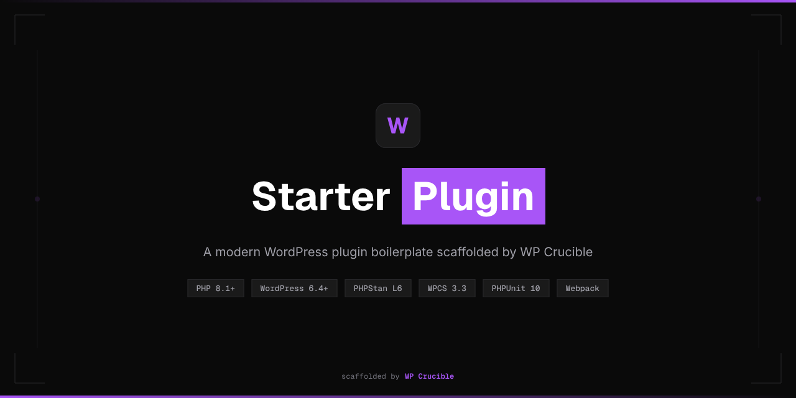

<p align="center">
  
</p>

<p align="center">
  <strong>A production-ready WordPress plugin boilerplate scaffolded by WP Crucible.</strong><br>
  Clone it. Rename it. Ship it.
</p>

<p align="center">
  
  
  
  
  
</p>

---

## Why Starter Plugin?

Most WordPress plugin tutorials start from scratch. Starter Plugin starts from **done** — a fully wired boilerplate with modern PHP, static analysis, automated testing, and wp.org compliance baked in from line one.

| What you get | Why it matters |
|---|---|
| **PSR-4 autoloading** | No more `require_once` chains — classes load automatically |
| **PHPStan Level 6** | Catch type errors before they reach production |
| **WPCS 3.3** | WordPress coding standards enforced on every commit |
| **PHPUnit + Brain\Monkey** | Unit tests without a WordPress installation |
| **Webpack via @wordpress/scripts** | Modern JS/CSS build pipeline with defer loading |
| **CI/CD workflows** | GitHub Actions for linting, testing, and releases |
| **wp.org ready** | Passes Plugin Check validation out of the box |

## Quick Start

```bash
# Clone the boilerplate
git clone <repo-url> my-awesome-plugin
cd my-awesome-plugin

# Install dependencies
composer install
npm ci

# Build front-end assets
npm run build

# Verify everything works
composer check        # PHPCS + PHPStan + PHPUnit
npm run lint:js       # ESLint
npm run lint:css      # Stylelint
```

## Rename in Seconds

Run the rename script to make it yours:

```bash
bash bin/rename.sh my-awesome-plugin MyAwesomePlugin
```

This updates **every** slug, namespace, prefix, constant, and filename across the entire project — including `composer.json`, `phpcs.xml.dist`, and `.wp-env.json`.

<details>
<summary>What gets renamed</summary>

| Variant | Before | After |
|---|---|---|
| Slug | `starter-plugin` | `my-awesome-plugin` |
| Namespace | `StarterPlugin` | `MyAwesomePlugin` |
| Function prefix | `starter_plugin_` | `my_awesome_plugin_` |
| Constant prefix | `STARTER_PLUGIN_` | `MY_AWESOME_PLUGIN_` |
| Global variable | `starter_plugin` | `my_awesome_plugin` |
| Main file | `starter-plugin.php` | `my-awesome-plugin.php` |

</details>

## Project Structure

```
starter-plugin/
├── starter-plugin.php          # Entry point: headers, constants, autoloader, boot
├── uninstall.php               # Cleanup on deletion
├── src/                        # PSR-4 root (StarterPlugin\)
│   ├── Plugin.php              #   Bootstrap & hook registration
│   ├── Admin/SettingsPage.php  #   Example Settings API page
│   └── Helpers/Assets.php      #   Script/style enqueue helpers
├── assets/
│   ├── src/                    #   JS & CSS source files
│   └── build/                  #   Webpack output (gitignored)
├── tests/
│   ├── bootstrap.php           #   Test bootstrap
│   ├── TestCase.php            #   Base class with Brain\Monkey
│   └── Unit/                   #   Unit test suite
├── bin/
│   ├── build-zip.sh            #   Distribution zip builder
│   └── rename.sh               #   Plugin rename script
├── .github/workflows/
│   ├── ci.yml                  #   PR/push: lint + test
│   └── release.yml             #   Tag: test matrix + GitHub Release
└── .wordpress-org/             #   wp.org listing assets
```

## Tech Stack

| Tool | Version | Purpose |
|---|---|---|
| PHP | 8.1+ | Runtime |
| WordPress | 6.4+ | Minimum supported version |
| WPCS | 3.3 | WordPress Coding Standards |
| PHPStan | 2.x (Level 6) | Static analysis with WordPress stubs |
| PHPUnit | 10.x | Unit tests with Brain\Monkey |
| @wordpress/scripts | 32.x | Webpack, ESLint, Stylelint, Prettier |
| @wordpress/env | 11.x | Local WordPress Docker environment |

## Development

### Local Environment

```bash
npm run env:start     # Launches wp-env (PHP 8.2, WP_DEBUG on)
npm run env:stop      # Stops the environment
```

### Running Checks

```bash
composer lint          # PHPCS only
composer analyze       # PHPStan only
composer test          # PHPUnit only
composer check         # All three in sequence

npm run build          # Build JS/CSS assets
npm run lint:js        # ESLint
npm run lint:css       # Stylelint
```

### Adding Features

1. Create a class in `src/` following PSR-4 (`src/Cron/DailyReport.php` = `StarterPlugin\Cron\DailyReport`)
2. Register hooks in `Plugin::register_hooks()` at the landmark comment
3. Write a test in `tests/Unit/` mirroring the `src/` structure
4. Run `composer check` before committing

### Extension Patterns

The boilerplate includes ready-to-copy skeletons for common patterns:

- **REST API endpoints** — with permission callbacks and route namespacing
- **Custom database tables** — using `dbDelta()` with version tracking
- **Cron jobs** — with proper schedule/unschedule lifecycle
- **Gutenberg blocks** — via `@wordpress/create-block` (requires `apiVersion: 3`)

See [CLAUDE.md](CLAUDE.md) for full extension skeletons and copy-paste examples.

## Release

```bash
# 1. Bump version in starter-plugin.php header + readme.txt Stable tag
# 2. Build and validate the zip
bash bin/build-zip.sh

# 3. Tag and push
git tag v1.0.1
git push origin v1.0.1
```

The `release.yml` workflow runs tests across PHP 8.1/8.2/8.4, validates with Plugin Check, builds the zip, and creates a GitHub Release.

## Contributing

See [CLAUDE.md](CLAUDE.md) for the full development guide — coding conventions, security rules, testing patterns, and forbidden rules that keep the plugin wp.org compliant.

## License

[GPL-2.0-or-later](https://www.gnu.org/licenses/gpl-2.0.html)
